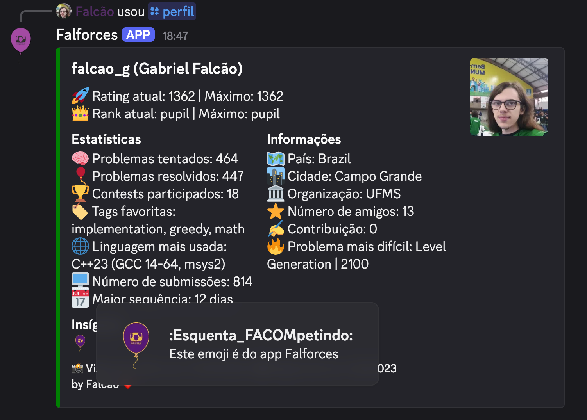

# ✔️ Diretrizes de contribuição

Obrigado por considerar contribuir para o Falforces! Sua ajuda é muito importante para melhorar o bot e torná-lo mais útil para a comunidade de Programação Competitiva.

Certifique-se de seguir o [Código de Conduta](CODE_OF_CONDUCT.md) e estas diretrizes ao contribuir para o projeto.

## 🤔 Como abrir uma issue?

1. Verifique se você está conectado à sua conta GitHub.
2. Abra a [página de issues](https://github.com/falcao-g/Falbot/issues) disponível no menu do repositório.
3. Clique em "New issue", este botão abrirá uma nova página onde você poderá selecionar o tipo de issue.
4. Selecione o tipo de issue, atualmente você pode abrir um relatório de bug ou uma solicitação de funcionalidade.
5. Preencha o formulário e clique em "Submit new issue".

## 🤝 Como abrir um pull request?

1. Faça um fork do repositório.
2. Clone o repositório forked.
3. Crie uma nova branch com o nome da feature que você está trabalhando.
4. Faça as alterações necessárias e faça um commit.
5. Depois disso, faça push para o repositório forked.
6. Após o push, acesse o repositório forked no Github e clique em "Compare & pull request".

## 🏅 Criando insígnias personalizadas

As insígnias são uma ótima maneira de reconhecer os participantes de competições oficiais. Atualmente, elas aparecem no comando `/profile` do bot, e são exibidas com base no handle, portanto, funcionam melhor com competições que ocorreram em plataformas como Codeforces, AtCoder, entre outras.

Segue abaixo o exemplo de uma insígnia usada para representar o Esquenta FACOMpetindo 2025:


Para criar sua própria insígnia personalizada, siga os passos abaixo:

1. Crie uma imagem representando a insígnia. O tamanho recomendado é 64x64 pixels, e o formato deve ser PNG com fundo transparente.
2. Certifique-se de que o nome do arquivo da imagem seja único e descritivo, por exemplo, `esquenta-facompetindo-2025.png`.
3. Adicione a imagem na pasta `assets/badges/` do repositório
4. No arquivo `utils/json/contests.json`, adicione uma nova entrada para a sua insígnia, seguindo o formato existente. Por exemplo:
   ```json
   {
   	"name": "Esquenta FACOMpetindo 2025",
   	"badge": "",
   	"contestants": ["handle1", "handle2", "handle3"]
   }
   ```
   A propriedade `contestants` deve ser uma lista dos handles dos participantes que receberão a insígnia. A propriedade `badge` será adiciona por um dos mantenedores após a submissão do pull request.
5. Faça um pull request com suas alterações. Certifique-se de incluir uma descrição clara do que você adicionou, caso tenha links que comprovem a participação dos handles na competição, inclua-os também. Organizadores dessas competições são encorajados a incluir seus próprios handles como reconhecimento pelo esforço de organização.
